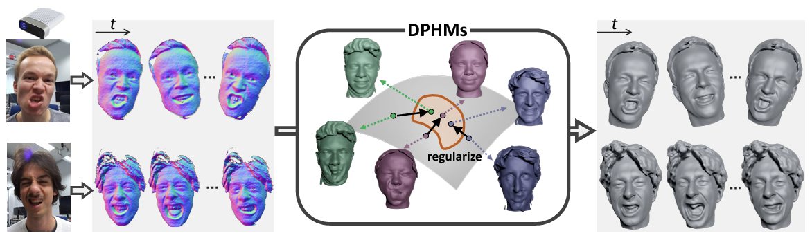

# DPHM

[**Paper**](https://arxiv.org/abs/2312.01068.pdf) | [**arXiv**](https://arxiv.org/abs/2312.01068.pdf)  | [**Video**](https://youtu.be/w_EJ5LDJ7T4) | [**Project Page**](https://tangjiapeng.github.io/projects/DPHMs/) <br>

This is the repository that contains source code for the paper:

**DPHMs: Diffusion Parametric Head Models for Depth-based Tracking**
<div style="text-align: center">

</div
- We present DPHMs, a diffusion parametric head model which is used for robust head reconstruction and expression tracking from monocular depth sequences. 
- Leveraging the DPHM diffusion prior, we effectively constrain the identity and expression codes on the underlying latent manifold when fitting to noisy and partial observations of commodity depth sensors.

## Installation
> Note that some of the steps below can take a while
```
conda env create -f environment.yml   
conda activate DPHM

pip install -e .

# Install pytorch with CUDA support
conda install pytorch==2.0.1 torchvision==0.15.2 torchaudio==2.0.2 pytorch-cuda=11.7 -c pytorch -c nvidia

# Install PytorchGeometry and helper packages with CUDA support
conda install pyg -c pyg
pip install pyg_lib torch_scatter torch_sparse torch_cluster torch_spline_conv -f https://data.pyg.org/whl/torch-2.0.0+cu117.html

# Install Pytorch3D with CUDA support
conda install -c fvcore -c iopath -c conda-forge fvcore iopath
conda install pytorch3d=0.7.4 -c pytorch3d
```

Next, you need to fill in some paths in `./src/dphm_tum/env_paths.py`.
Before this use `cp src/dphm_tum/env_paths.template src/dphm_tum/env_paths.py` to create your local version and 
set the paths according to your system.
The provided comments are hopefully enough explanation.

Finally, fix some versioning:
```
pip install numpy==1.23
pip install pyopengl==3.1.5
```

## Download Pretrained Model, Assets and Example Data

You can find all necessary data here.

## Train DPHMs

Before we train Diffusion Parametric Head Models, we need to train Neural Parametric Head Models (NPHMs) with backward deformations. 

### Pre-train NPHMs 
To train [NPHMs](https://github.com/SimonGiebenhain/NPHM), please follow its instructions 
to preprocess datasets for SDF field learning.  You can train your NPHMs through
```
python scripts/training/launch.py --cfg-file configs/n3dmm_anc39_iden1344_expr200.yaml --exp-name nphm_backward
```
or we suggest you use a pretrained model of NPHMs with backward deformations, as the training would take several days. You can test the pre-trained NPHMs by decoding and visualizing the fitted parametric latents on the train dataset. For example, you can generate the fitted 3D head of 100-th identity with 0-th expression.
```
python scripts/dphm/nphm_vis.py -iden 100 -expr 0
```

### Train identity / Expression Latent Diffusion Models
Based on the fitted latents on the train dataset, we use latent diffusion models to explicitly learn the distribution of identity and expression parametric latents.
The latent diffusion is based on UNet-1D + attention layers from [DDPM](https://github.com/lucidrains/denoising-diffusion-pytorch/blob/main/denoising_diffusion_pytorch/denoising_diffusion_pytorch_1d.py).
```
DISPLAY=:0 xvfb-run -a  python scripts/dphm/train_diff_1d_backward.py -cfg_file scripts/dphm/configs/diff_iden_dim64_mults4.yaml -exp_name nphm_diff_iden_dim64_mults4
DISPLAY=:0 xvfb-run -a  python scripts/dphm/train_diff_1d_backward.py -cfg_file scripts/dphm/configs/diff_expre_dim64_mults4.yaml -exp_name nphm_diff_expre_dim64_mults4
```
We add ```DISPLAY=:0 xvfb-run -a```, as we want to render the randomly generated meshes during training as images for debugging.

### Unconditionally generate 3D head avatars
After training parametric latent diffusion models, we can randomly sample noises, and then apply diffusion models to transform them into meaningful identity or expression latents.
```
DISPLAY=:0 xvfb-run -a  python scripts/dphm/sample_diff_1d_backward.py  -cfg_file scripts/dphm/configs/diff_expre_dim64_mults4.yaml -exp_name dphm_iden_dim64_mults4 
DISPLAY=:0 xvfb-run -a  python scripts/dphm/sample_diff_1d_backward.py  -cfg_file scripts/dphm/configs/diff_iden_dim64_mults4.yaml -exp_name dphm_expre_dim64_mults4 
```

## Apply DPHMs for head tracking

The following gives intructions how to run the depth-based head reconstruction and tracking from commodity sensors using diffusion priors.

### Installing the Preprocessing Pipeline

Our preprocessing pipeline relies on the FLAME model. Therefore, you will need an account for the [FLAME website](https://flame.is.tue.mpg.de/).
Let me know if you have any trouble concerning that.

Also, you will need to download the pretrained [normal detector](https://github.com/boukhayma/face_normals/tree/5d6f21098b60dd5b43f82525383b2697df6e712b) from [here](https://drive.google.com/file/d/1Qb7CZbM13Zpksa30ywjXEEHHDcVWHju_/edit).
Place the downloaded `model.pth` into `src/nphm_tum/preprocessing/pretrained_models/model.pth`.

Similarly, download the weights for the employed [facial landmark detector](https://github.com/jhb86253817/PIPNet) from [here](https://drive.google.com/drive/folders/17OwDgJUfuc5_ymQ3QruD8pUnh5zHreP2).
Download the folder `snapshots/WFLW` and place it into `src/nphm_tum/preprocessing/PIPnet/snapshots`. 

Finally run `install_preprocessing_pipeline.sh`

### Running the Preprocessing

First we need to preprocess a bunch of data, namely this includes:
- unproject depth maps to partial scans
- landmark detection
- FLAME fitting to get a rough initialization of the camera pose


### Running the Tracking

Once the preprocessing is done, you can start the dphm depth tracking using:


